# ALTERA_CREATE_SO_INTEGRAT — Change Review Report

**Version:** 01.00.0032 → 01.00.0033
**Overall Risk:** 🟡 Medium | **Recommendation:** 🟡 APPROVE WITH CONDITIONS

---

## 1. Header

| Field | Value |
|---|---|
| **Integration** | ALTERA_CREATE_SO_INTEGRAT |
| **Version From** | 01.00.0032 |
| **Version To** | 01.00.0033 |
| **Generated At** | 2026-03-14T01:29:02.391264+00:00 |
| **Generated By** | iar-lens |
| **Files Read** | 56 |
| **Processors Investigated** | 8 |

---

## 2. What This Integration Does

This integration automates the end-to-end process of creating and managing sales orders, connecting a source system (potentially an internal portal or external application) with a backend Enterprise Resource Planning (ERP) or Order Management System (OMS). It ensures sales order data, including customer addresses and delivery details, is accurately transferred, processed, and tracked, while also managing associated logistics like shipments and pick waves. The integration includes robust error handling and status updates to keep relevant business users informed.

**Change Classification:** `Scope Expansion` — New assignments, content-based routers, and notifications were added to provide more specific post-processing logic and enhanced communication based on integration outcomes, extending its reporting capabilities.

---

## 3. What Changed

**Summary of Change:**
This update significantly enhances the integration's ability to communicate the final status of sales order processing. Previously, general notifications were likely sent upon completion or error. With this change, after a sales order has been fully processed (created, updated, or encountered an error), the system now performs additional checks. This allows for more granular and targeted alerts to relevant business stakeholders based on specific outcomes or conditions, improving overall transparency and enabling quicker, more informed responses to sales order statuses.

**Before (v01.00.0032):**
The integration initiates upon receiving a sales order creation request from a source system. It first prepares the data, then iteratively fetches sales order header details and checks their status. The core process involves complex data transformations to create or update the sales order in the backend ERP/OMS, potentially triggering related logistics like shipment and delivery processes, and updating customer addresses if required. Throughout the process, various notifications are sent to indicate progress or issues, with comprehensive error handling to manage exceptions and ensure data integrity.

**After (v01.00.0033):**
Similar to the previous version, the integration starts with a sales order creation request, preparing data, and then fetching and validating sales order headers. It proceeds to transform and process the sales order in the backend ERP/OMS, manage shipments, deliveries, and customer addresses, and handle errors. The key enhancement in this version is the addition of a final post-processing stage. After all primary tasks and error handling are finished, the integration now includes new conditional logic to assess the overall outcome and send more specific, targeted notifications to different stakeholders based on the specific success, warning, or failure conditions encountered.

---

## 4. Executive Summary

| Field | Value |
|---|---|
| **Overall Risk** | 🟡 Medium |
| **Recommendation** | 🟡 APPROVE WITH CONDITIONS |

**What Changed:**
- Step count changed from **72 → 80** (8 new, 0 removed, 0 positionally shifted)

**What Was Added:**
- **Assign_11623** (assignment) — This new step initializes a string variable named `varCount` to the literal value '0', likely intended for use as a counter or flag within the enhanced post-processing logic.
- **Assign_11630** (assignment) — This new assignment step initializes a string variable named `varStatus`, which will likely be populated later in the flow to track the overall processing outcome for sales orders.
- **Assign_11643** (assignment) — This new assignment step extracts the sales order's final processing 'Status' from the 'getSOLineStatus' service response and stores it in a variable named 'varStatus'.
- **Assign_11649** (assignment) — Increments a counter variable `varCount` by one, likely used to track iterations, processed items, or as a control variable within new post-processing logic.
- **Router_11655** (contentBasedRouter) — This Content-Based Router is added to direct the integration flow based on the `varStatus` variable, specifically checking if a sales order is 'Awaiting Shipping' to trigger distinct post-processing logic.
- **Notification9** (notification) — Sends a targeted email notification, likely upon completion of a specific 'Line Processing' stage or an error related to 'Factory-Doc Integration' within the Oracle Shipment Request (OSR) process, to inform relevant stakeholders.
- **Router_11974** (contentBasedRouter) — This new content-based router directs the integration flow down different paths based on whether shipments were associated with the sales order, enabling specific post-processing actions.
- **Notification10** (notification) — This new notification step sends a targeted email to relevant stakeholders when the integration encounters an "Error in Pick Wave" during sales order processing, providing specific details like the Oracle Shipment Request (OSR) number and integration instance ID.

**What Was Removed:**

---

## 5. Statistics

| Metric | Count |
|---|---|
| Source step count | 72 |
| Target step count | 80 |
| New steps | 8 |
| Removed steps | 0 |
| Genuinely reordered | 0 |
| Positionally shifted | 0 |
| Unchanged | 72 |

---

## 6. Legend

| Style | Meaning |
|---|---|
| 🟢 Green box | New step added in target version |
| 🔴 Red box | Removed step, existed in source version |
| ⚪ Grey box | Context step, unchanged or shifted, shown for reference |
| 🔴 HIGH | High risk change — requires immediate attention |
| 🟡 Medium | Medium risk — verify before approving |
| 🟢 Low | Low risk — informational |

---

## 7. New Steps

### Block 1 — Notifications (positions 73–80)

```mermaid
flowchart LR
    N0[Assign_10510<br/>assignment]:::ctx
    N1[Assign_11200<br/>assignment]:::ctx
    N2[Assign_11623<br/>assignment]:::new
    N3[Assign_11630<br/>assignment]:::new
    N4[Assign_11643<br/>assignment]:::new
    N5[Assign_11649<br/>assignment]:::new
    N6[Router_11655<br/>contentBasedRouter]:::new
    N7[Notification9<br/>notification]:::new
    N8[Router_11974<br/>contentBasedRouter]:::new
    N9[Notification10<br/>notification]:::new
    N0 --> N1
    N1 --> N2
    N2 --> N3
    N3 --> N4
    N4 --> N5
    N5 --> N6
    N6 --> N7
    N7 --> N8
    N8 --> N9
    classDef new fill:#ccffcc,stroke:#008800,color:#004400
    classDef ctx fill:#e8e8e8,stroke:#aaa,color:#444
```

| # | Step | Type | Purpose | Business Impact | Risk |
|---|---|---|---|---|---|
| 1 | Assign_11623 | assignment | This new step initializes a string variable named `varCount` to the literal value '0', likely intended for use as a counter or flag within the enhanced post-processing logic. | This initialization supports the new conditional post-processing and targeted notifications, enabling more granular communication and quicker, more informed business responses to sales order statuses. | 🟢 Low |
| 2 | Assign_11630 | assignment | This new assignment step initializes a string variable named `varStatus`, which will likely be populated later in the flow to track the overall processing outcome for sales orders. | This step enables the subsequent granular outcome assessment and targeted communication to stakeholders, leading to improved transparency and quicker, more informed responses to sales order statuses. | 🟢 Low |
| 3 | Assign_11643 | assignment | This new assignment step extracts the sales order's final processing 'Status' from the 'getSOLineStatus' service response and stores it in a variable named 'varStatus'. | This step is critical for enabling the enhanced post-processing and conditional logic, allowing for more granular and targeted communication to stakeholders based on the precise sales order status. | 🟢 Low |
| 4 | Assign_11649 | assignment | Increments a counter variable `varCount` by one, likely used to track iterations, processed items, or as a control variable within new post-processing logic. | By contributing to a counting mechanism, this step supports the new enhanced post-processing and targeted notification capabilities by enabling iterative processing or tracking of occurrences for more granular outcome assessment. | 🟢 Low |
| 5 | Router_11655 | contentBasedRouter | This Content-Based Router is added to direct the integration flow based on the `varStatus` variable, specifically checking if a sales order is 'Awaiting Shipping' to trigger distinct post-processing logic. | This new router enables more granular, outcome-based communication and post-processing, allowing different stakeholders to receive tailored updates based on the sales order's specific status, such as 'Awaiting Shipping'. | 🟢 Low |
| 6 | Notification9 | notification | Sends a targeted email notification, likely upon completion of a specific 'Line Processing' stage or an error related to 'Factory-Doc Integration' within the Oracle Shipment Request (OSR) process, to inform relevant stakeholders. | This new step enhances the integration's ability to provide granular and targeted alerts about specific outcomes or conditions, improving overall transparency and enabling quicker, more informed responses to sales order statuses, particularly for shipment requests. | 🟡 Medium |
| 7 | Router_11974 | contentBasedRouter | This new content-based router directs the integration flow down different paths based on whether shipments were associated with the sales order, enabling specific post-processing actions. | This addition allows for more targeted communication and specific post-processing actions, such as sending alerts to relevant stakeholders, depending on whether shipments were generated for the sales order. | 🟡 Medium |
| 8 | Notification10 | notification | This new notification step sends a targeted email to relevant stakeholders when the integration encounters an "Error in Pick Wave" during sales order processing, providing specific details like the Oracle Shipment Request (OSR) number and integration instance ID. | Adding this specific error notification significantly enhances error visibility for "Pick Wave" related issues, allowing business users to respond more quickly and effectively, thus improving overall sales order fulfillment and reducing operational delays. | 🟢 Low |

---

## 8. Removed Steps

---

## 9. Key Observations

1. The integration has expanded its post-processing and notification capabilities, moving from general to highly specific and targeted communications based on sales order outcomes.
2. New variables (`varCount`, `varStatus`) have been introduced to support the new conditional logic and tracking of sales order statuses.
3. Two new Content-Based Routers (`Router_11655`, `Router_11974`) are critical for directing the flow based on sales order status (e.g., 'Awaiting Shipping') and whether shipments were generated.
4. Targeted email notifications (`Notification9`, `Notification10`) have been added to provide specific alerts for shipment processing, 'Factory-Doc Integration' errors, and 'Pick Wave' errors, enhancing error visibility and stakeholder awareness.
5. The medium risks identified are related to the dynamic population of notification variables and the reliance of a new router on an external service response, which require thorough validation to prevent miscommunication or incorrect routing.

---

## 10. Approval Conditions

| # | Condition | Risk |
|---|---|---|
| 1 | Thoroughly test `Notification9` and `Notification10` to confirm correct dynamic variable population for recipients, sender, and subject, ensuring accurate information delivery to the intended stakeholders. | 🟡 Medium |
| 2 | Conduct comprehensive testing of `Router_11974` to verify that all expected responses from the `getDeliveryNumber` service correctly trigger the intended conditional paths, leading to accurate post-processing actions and stakeholder communication. | 🟡 Medium |

---

*Generated by **iar-lens** — Hybrid Python + Gemini IAR Change Review Tool*